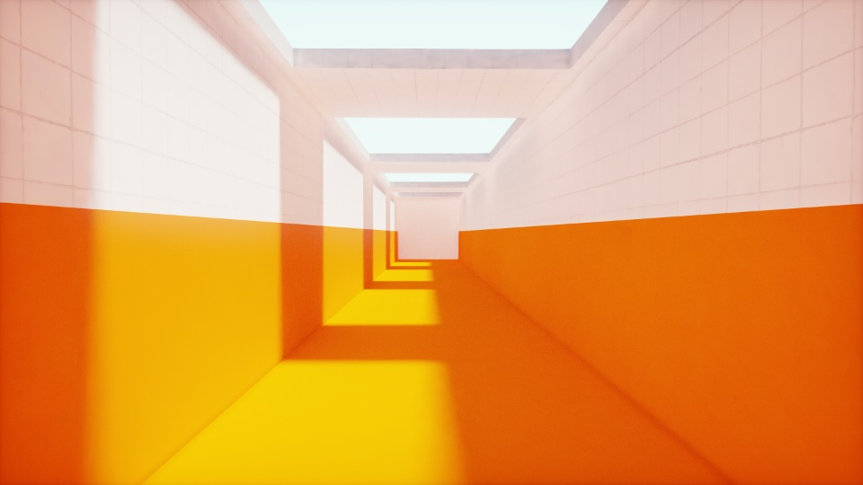

# Armory Lightmapper
Armory Lightmapper is an addon for Armory3D that implements lightmapping and denoising capabilities for GI texture baking with support for HDR Lightmaps.

Todo: Updated description...

## More images

Everyone of these images are screenshots from inside Armory, most at 256x256 or 512x512 resolution lightmaps, easily running 60 fps. Baking only took a few minutes, often mere seconds including denoising.

