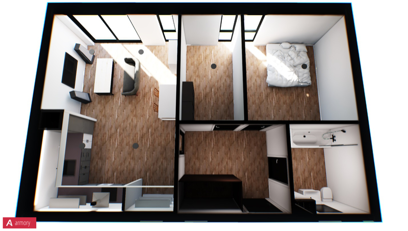
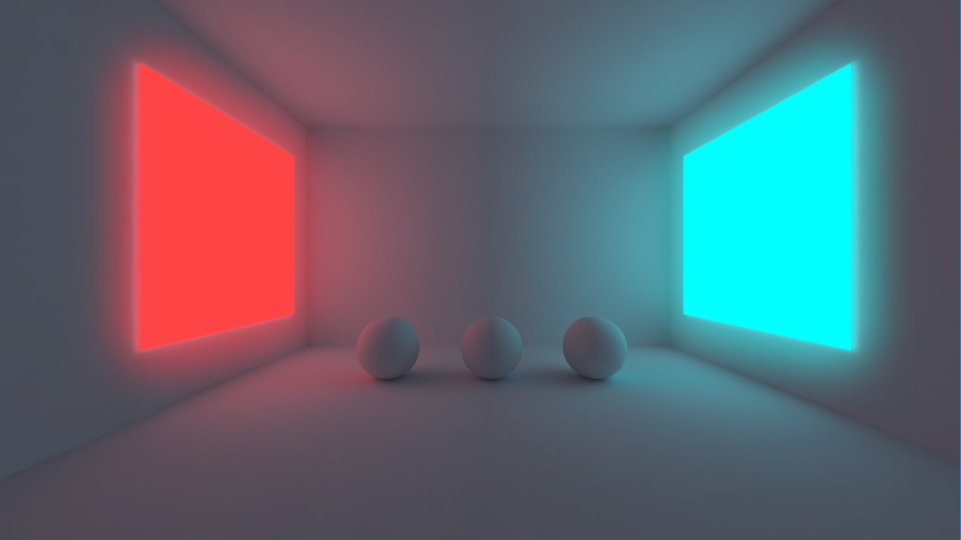
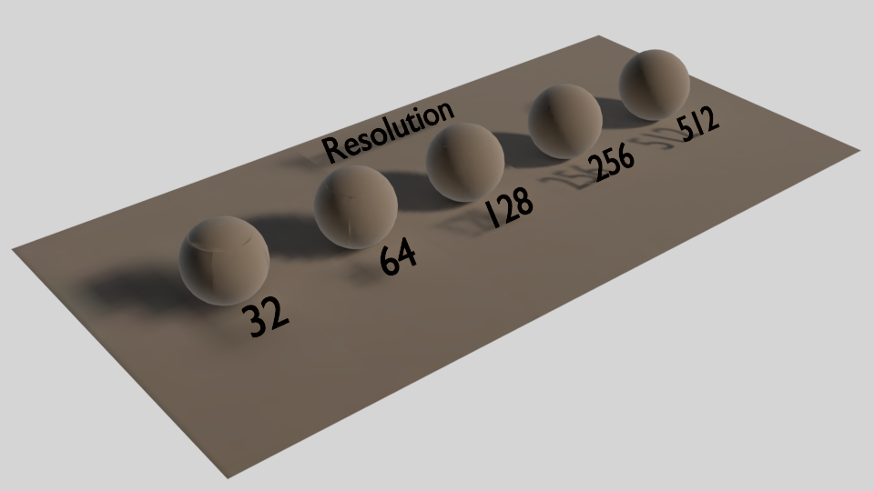
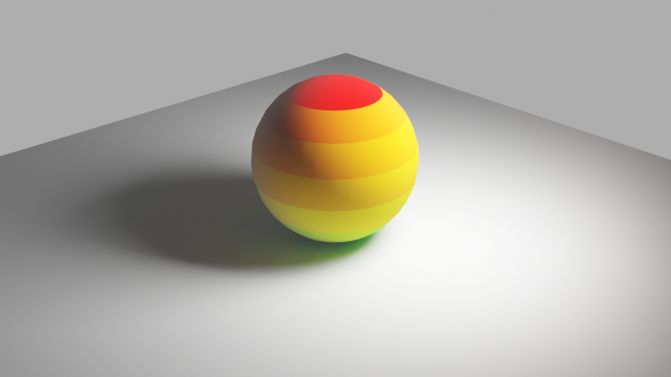
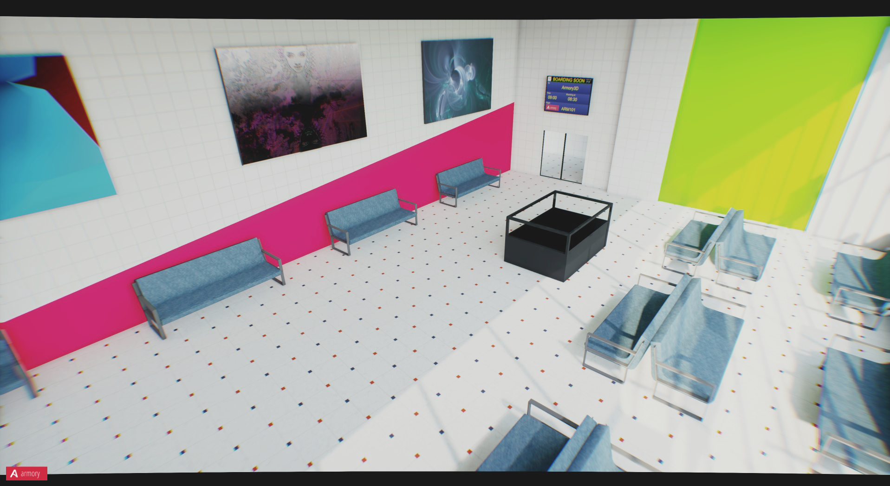
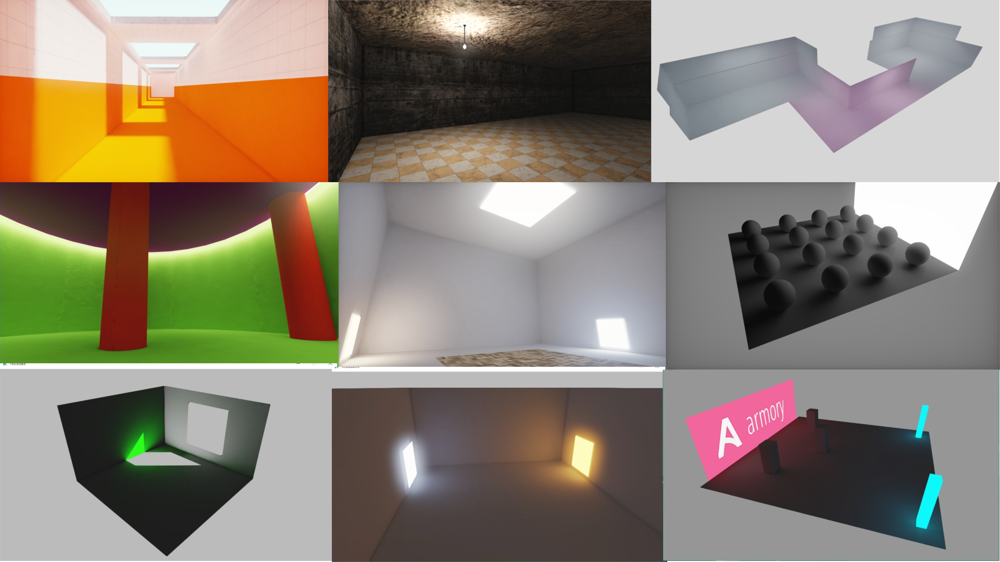
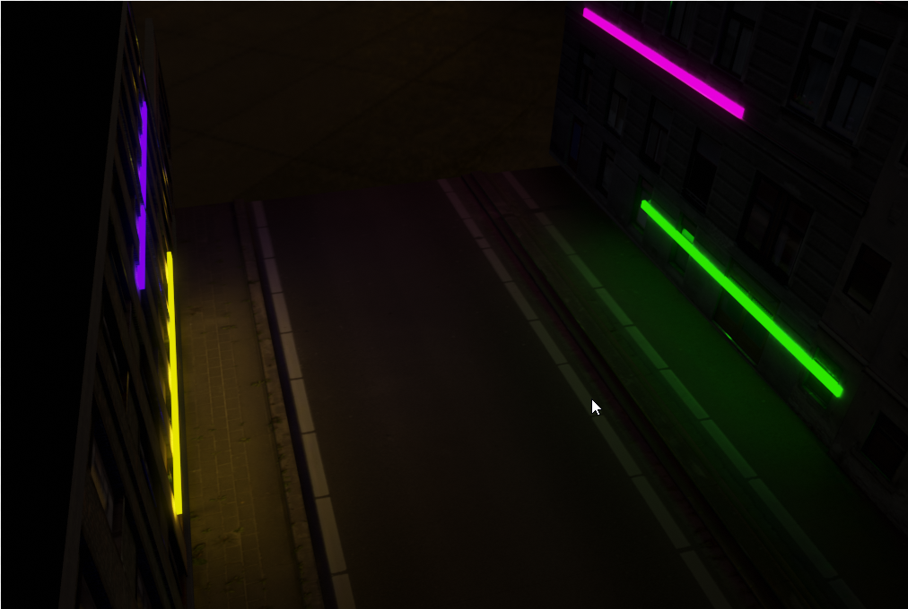

## The Lightmapper

### Support

If you're in need of help, or have some questions feel free to send me an [mail](https://github.com/Naxela) or contact me on Discord (Username: Naxela#7255). If you've stumpled upon a bug, please open a new ticket here, and I'll try to get it solved as fast as possible: https://github.com/Naxela/The_Lightmapper/issues

### Description

The Lightmapper is an addon for Blender that implements lightmapping and denoising capabilities for global illumination texture baking with support for 32-bit HDR Lightmaps. 
Baking is done through Cycles, and includes automatic material setup, automatic UV setup, encoding options, format options and advanced postprocess filtering. The setup is object-centric, meaning that you can customize the settings for each individual object, providing you with the easiest and most versatile lightmapping solution for Blender.

### Features - Version 0.3
- Automated lightmap baking

The addon automates everything you need to bake, ranging from scaling, material setup, uv-layering, uv-unwrapping and more:

- Per-object settings

Each object can have it's own settings and be customized in terms of resolution, uv margin and unwrap mode:

- Multi-material support

Add as many materials to each object as you want:

- AI-based Denoising

Integrated denoising as well as support for faster CPU OIDN denoising and GPU Optix denoising:

- Performance and speed

Baking presets automatically adjusts sampling, quality and tile settings based on situation and CPU/GPU:

- Postprocess filtering

Additional filtering to give your lightmaps an extra edge and quality through OpenCV:

- Background-baking

Is your baking going to take a long time? Try background baking, which let's you continue working on your scene:

- Easy material management

Apart from automatic material setup, resetting materials is easy and baking without material setup too for external engines:

### Installation

Installation of The Lightmapper is straight forward. All you need to do is download the latest release, and install as a .zip file from inside Blender. For more information, please refer to the wiki section: COMING SOON

### Usage

For more information, please refer to the wiki section: COMING SOON

### Documentation

The wiki page is under construction, and documentation is in the process of being written.

### Images and Videos

*HTML5 lightmap examples - Powered by Armory3D*

http://laboratory.naxela.info/experiment_1/

http://laboratory.naxela.info/experiment_2/

http://laboratory.naxela.info/experiment_3/

http://laboratory.naxela.info/experiment_4/

http://laboratory.naxela.info/experiment_5/

http://laboratory.naxela.info/experiment_7/

http://laboratory.naxela.info/experiment_8/

http://laboratory.naxela.info/experiment_11/

http://laboratory.naxela.info/experiment_12/

http://laboratory.naxela.info/experiment_13/

----

*3rd Party addon compatibility*

- OpenCV:
https://pypi.org/project/opencv-python/

- Blender Xatlas by Mattedicksoncom:
https://github.com/mattedicksoncom/blender-xatlas
