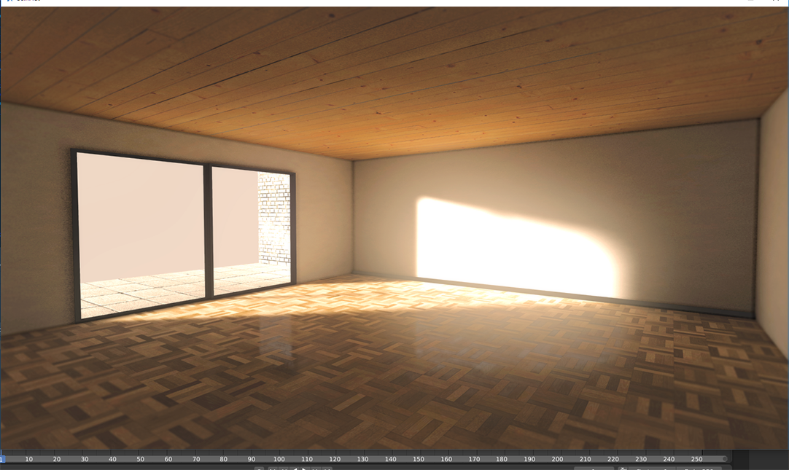
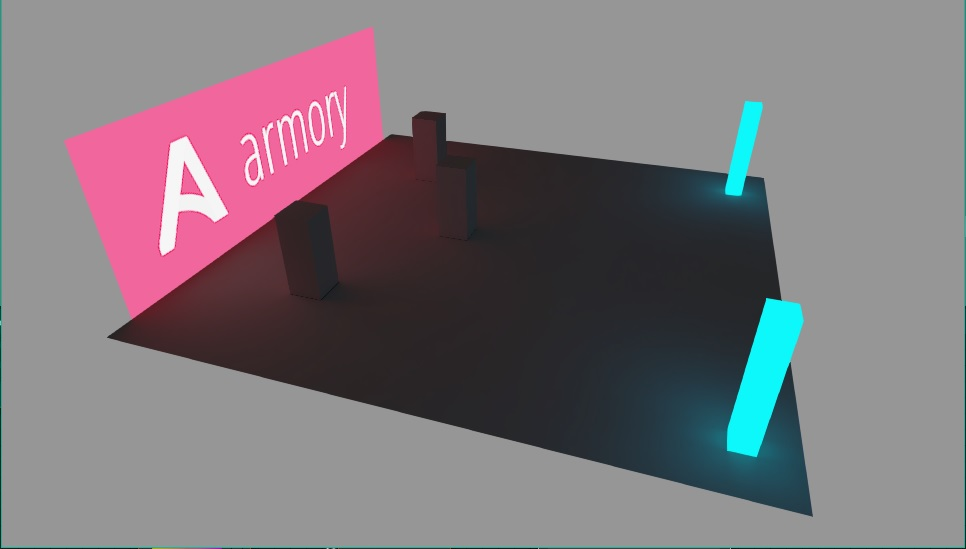

# Armory Lightmapper
Armory Lightmapper is an addon for Armory3D that implements lightmapping and denoising capabilities for GI texture baking with support for HDR Lightmaps.

It expands the existing Armory bake tool with HDR lightmap baking (diffuse + indirect contribution as 32 bit float), as well as an OIDN based denoising. It is structured in this way:

- Bake 32 bit lightmap with cycles
- Denoise the map with Intel Denoiser (Convert to an from .pfm file)
- GIMP-based filtering (Optional/WIP)
- Encode to compatible 8-bit RGBA png with RGBM/RGBD encoding
- Use nodegroups to decode RGBM HDR lightmaps and auto apply

## How To
It is implemented in the Armory baketool. Just copy or clone it into your armsdk folder. Scroll down to your "Armory Bake" tab, and set bake type to "Lightmap".

Set your UV-margin to something like 0.05 to give your packing a little space, depending on your lightmap size, and filtering options.

Also, note for now it is recommended to choose the option "Save" on apply, as packing it into the .blend file seems to cause crashes with the current Blender beta version.

When you bake, 32-bit float maps will be baked and saved into your "/Lightmaps" folder if the option is chosen.

When you click Apply afterwards, these maps will be saved and denoised. When they are denoised, a node-setup will be applied automatically to your material setups, and applied to your basecolor.

By default, the lightmaps might seem a bit weak compared to Cycles/Eevee due to different color management, but it can be adjusted by:
- Try messing around with the Armory tonemappers
- Crank up the exposure value (Look under "Film" in Cycles)
- Try out the latest Postprocess settings (Addon here: https://github.com/Naxela/PPM)

## Limitations / Todo
- Look into LogLUV Encoding (More expensive, but better interpolation/less banding)
- RGBD and perhaps RGBE encoding.
- More work with GIMP postprocess filters
	- Ordinary gaussian filtering
	- Selective gaussian filtering
	- Custom A-Trous filtering
	- Dither/Debanding
- Look into HDR/EXR support.
- Make further light calibrations to match either
- Fix errors
- Test Linux/OSX (I've only tested Windows for now)

## More images

