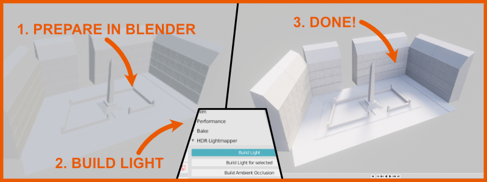
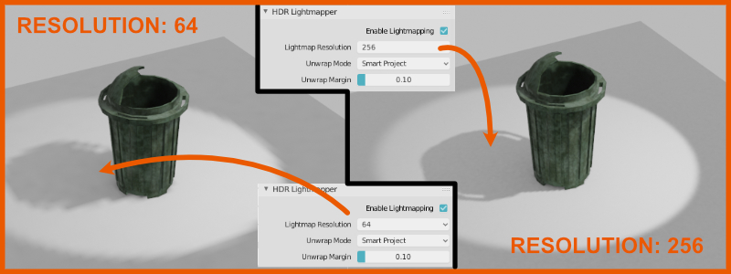
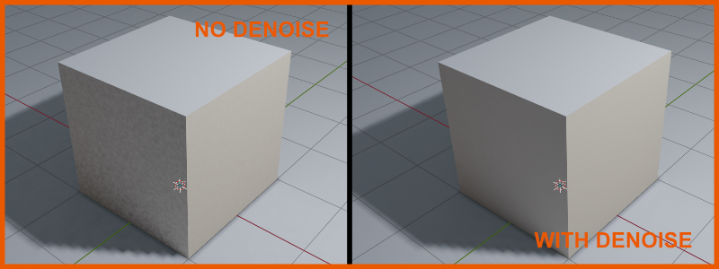
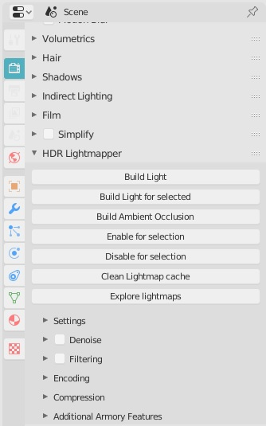
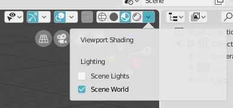
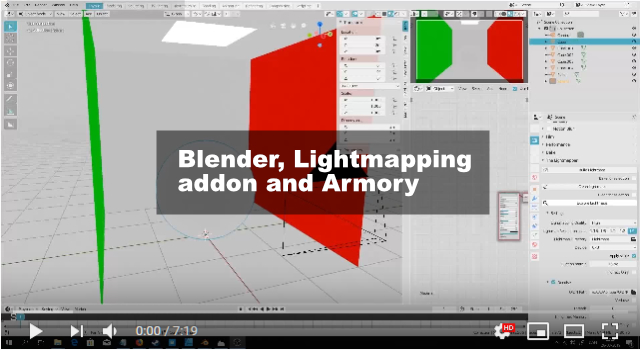

# HDR Lightmapper (Previously Armory Lightmapper)

# Description

HDR Lightmapper is an addon for Blender that implements lightmapping and denoising capabilities for global illumination texture baking with support for 32-bit HDR Lightmaps.

Development information thread here: http://forums.armory3d.org/t/hdr-lightmaps-addon/3074/6

It's free and open-source.

## Features [Version 0.1]:
- Cycles-based automated lightmap baking

- Per-object settings and individual resolution setting

- Denoising with Intel OIDN (Bundled)

- Automatic CPU/GPU option and switching

- Scalable lightmapping quality and resolution

- OpenCV Based filtering options for post-processing

- Automatic Installation for OpenCV

- Direct 32-bit RGBE (.hdr) export for Armory/EEVEE/Unity

- RGBM/RGBD png encoding for non-compatible engines (Godot/UE4/Etc.)

- Automatic node-management (Setup, backup, restoration)

## Upcoming/Todo features:
- More stability
- More documentation
- New denoising option - NVIDIA Optix
- Automated AO baking and node management
- New filtering options
- Equirectangular panoramic rendering with EEVEE
- Cubemap panoramic rendering with EEVEE
- Spherical Coefficient gathering
- Additional bake-time Object/Light/World controls
- Lightmap Adjustment Tools
- Addon refactoring
- Network Rendering
- Texel Density management
- UV/Lightmap Preparation tools
- and more....

# Installation

Installation of the addon is straight forward. Get the latest release here, and select the zip-package: 

https://github.com/Naxela/HDR_Lightmapper/releases

### Note! - Releases are recommended, git versions are most likely unstable

# Usage

The addon consists of 2 panel for now:

The main panel located under the Render context tab controls quality and general settings for the baking process, including denoising, filtering, lightmap-location and more:

The second panel is located under the object tab, and controls the individual baking resolution as well as specific unwrap settings for the object:

The easiest way to get started is:
- Make a scene with a cube, a plane and a light
- Select the cube and the plane
- Click "Build Light for selected" in the main HDR Lightmapper panel
- Baking should take a few seconds
- Turn on Eevee with World Light for better and quick visual review:

# Videos:

Blender, Lightmapping and Armory

# Armory HTML5 examples using Baked GI w. HDR Lightmaps:

Naxela's Laboratory (No quality scaling, requires decent specs):

Experiment 1: http://laboratory.naxela.info/experiment_1/

Experiment 2: http://laboratory.naxela.info/experiment_2/

Experiment 3: http://laboratory.naxela.info/experiment_3/

# Images:

