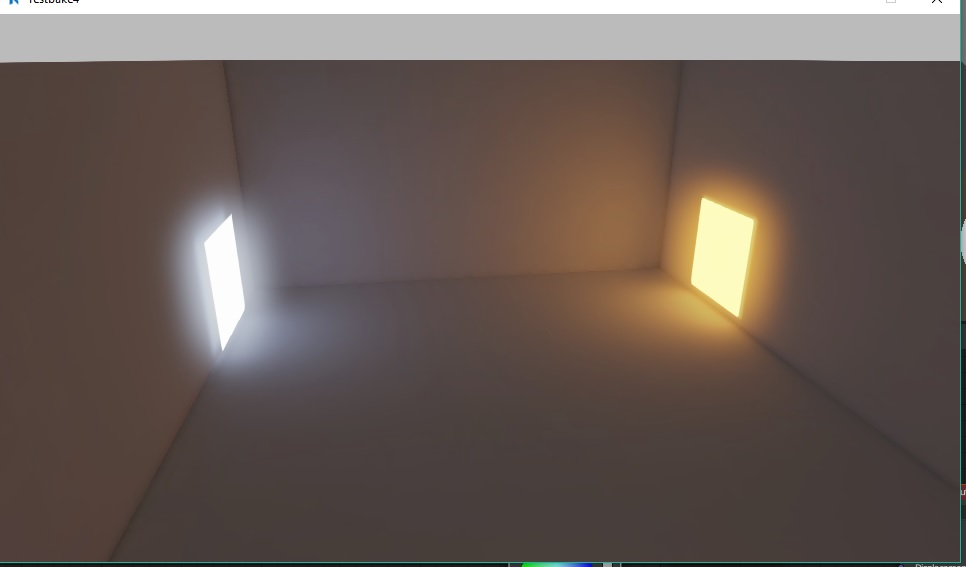
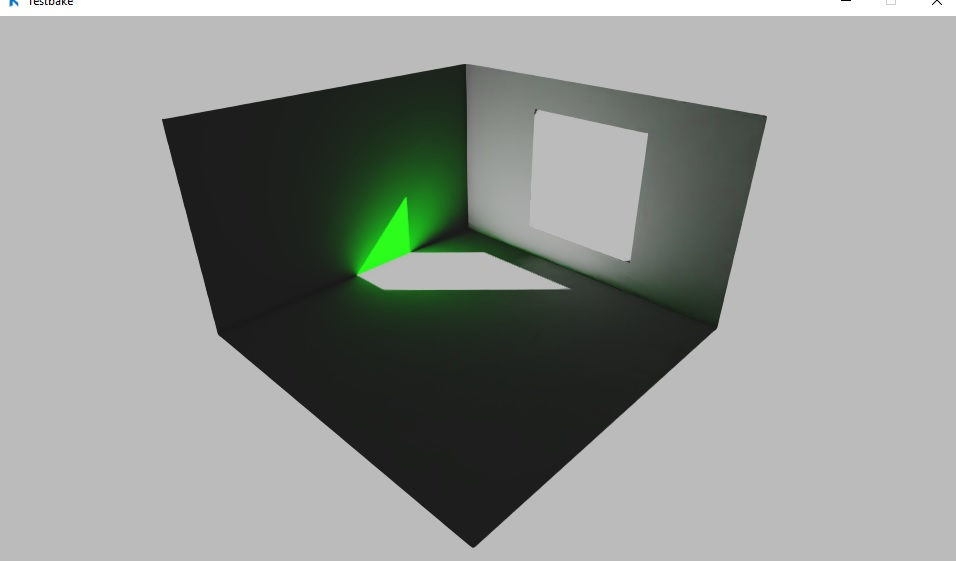
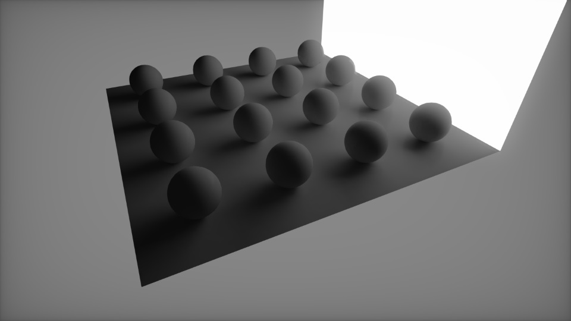
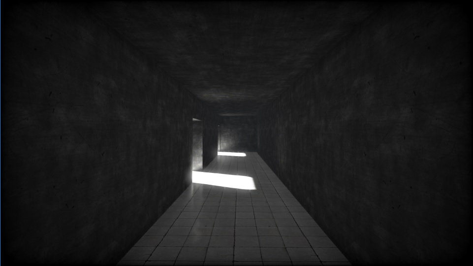
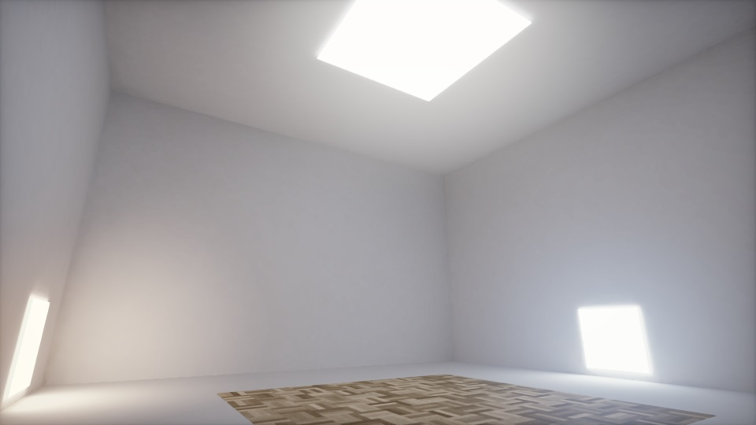
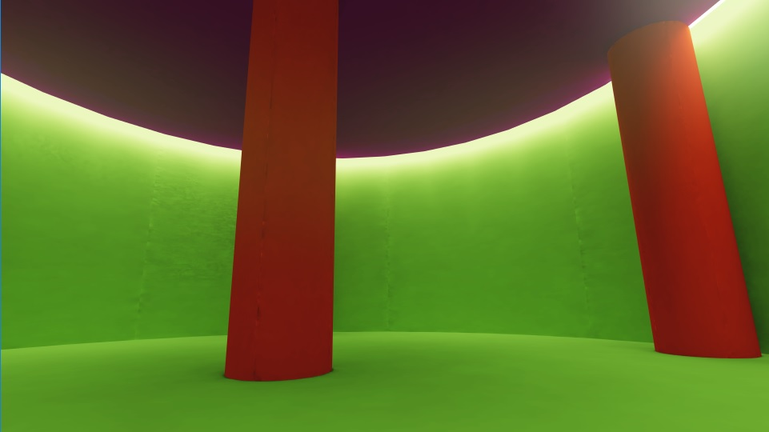
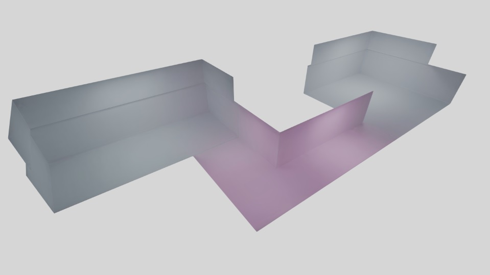

# Armory Lightmapper
Armory Lightmapper is an addon for Armory3D that implements lightmapping and denoising capabilities for GI texture baking with support for HDR Lightmaps.

It expands the existing Armory bake tool with HDR lightmap baking (diffuse + indirect contribution as 32 bit float), as well as an OIDN based denoising. It is structured in this way:

- Bake 32 bit lightmap with cycles
- Denoise the map with Intel Denoiser (Convert to and from .pfm file)
- GIMP-based filtering (Optional/WIP)
- Encode to compatible 8-bit RGBA png with RGBM/RGBD encoding
- Use nodegroups to decode RGBM HDR lightmaps and auto apply

Note, the banding in the image above is due to gif compression. Actual banding is more miniscule, but still present.

## How To
It is implemented in the Armory baketool. Just copy or clone it into your armsdk folder. Scroll down to your "Armory Bake" tab, and set bake type to "Lightmap".

Set your UV-margin to something like 0.05 to give your packing a little space, depending on your lightmap size, and filtering options.

Also, note for now it is recommended to choose the option "Save" on apply, as packing it into the .blend file seems to cause crashes with the current Blender beta version.

When you bake, 32-bit float maps will be baked and saved into your "/Lightmaps" folder if the option is chosen.

When you click Apply afterwards, these maps will be saved and denoised. When they are denoised, a node-setup will be applied automatically to your material setups, and applied to your basecolor.

By default, the lightmaps might seem a bit weak compared to Cycles/Eevee due to different color management, but it can be adjusted by:
- Try messing around with the Armory tonemappers
- Crank up the exposure value (Look under "Film" in Cycles)
- Try out the latest Postprocess settings (Addon here: https://github.com/Naxela/PPM) - It opens up for node settings, such as exposure, gamma, gain, etc. which can help in terms of that.

## Todo
- Look into LogLUV Encoding (More expensive, but better interpolation/less banding)
- More work with GIMP postprocess filters
	- Ordinary gaussian filtering
	- Selective gaussian filtering
	- Dither/Debanding
- Maybe use PIL or SciPy instead of GIMP
- Look into HDR/EXR support.
- Make further light calibrations to match
- Fix errors
- More testing/calibration
- Lightmapping image tools
- Pack multiple lightmaps into a single atlas
- Find compression algorithms
- Network-distributed rendering
- Set max-range manually
- Make a less-cluttered bake panel
- Separable direct and indirect contribution
- Lightmap blending
- Lightmap condition sets
- Directional lightmaps
- Make cycles rendering presets (such as Preview, Medium, High, Production)
- Multi-threaded encoding
- More condition checkup on bake and apply (to prevent wasted time and reuse)
- Investigate odd texture overrides in Armory when fake-users are applied for a material
- Investigate odd uv shifting in Armory

## Tips

- Before you apply/denoise, make sure you turn your displays to "Wireframe" or "Solid" mode, as it seems to crash otherwise once the textures are applied (Due to the Blender Eevee version that Armory 0.6 comes bundled with)
- If your results look weird, it MIGHT help to:
	- Change your world/environment settings
	- OR turn of "Irradiance" and "Radiance" probes under the renderpath world settings, maybe due to spherical harmonics being applied to the baked result.
- Use RGBM encoding for most of your stuff, although RGBD might look better with highlights in rare cases.
- Don't use underscores for material or object names, it breaks the bake-tool! Use dots or lines instead
- Due to the compression of light values, interior values can really be a pain but it's possible to get good results with even large ranges
- Controlling the lightmap properties with a brightness/contrast node can be useful

## More images

Everyone of these images are screenshots from inside Armory, most at 256x256 or 512x512 resolution lightmaps, easily running 60 fps. Baking only took a few minutes, often mere seconds including denoising.

